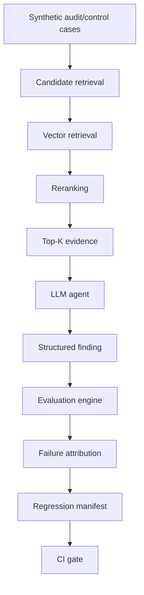

# Agent Reliability Lab

An evaluation and regression-testing framework for evidence-grounded
enterprise AI agents.

This is an independent, portfolio-scale reliability experiment — not a
reproduction of any employer's proprietary system, and not a claim to
be production software. It studies one specific, narrow question:

> **Can an enterprise agent produce reliable conclusions when evidence
> is retrieved from a noisy corpus, rather than supplied as curated
> context?**

## Why this exists

An LLM agent can return a structurally valid, well-cited, schema-clean
answer while still reaching the wrong conclusion. Checking "did the
model return valid JSON" or "did it cite documents that exist" is not
the same as checking "did it reach the right answer" — and a pipeline
that measures only retrieval quality (recall, MRR) can look nearly as
good as an oracle-context baseline while the agent's actual decisions
degrade sharply underneath it.

This repository builds the smallest complete pipeline needed to make
that gap measurable end to end — synthetic benchmark → retrieval →
reranking → LLM agent → evaluation → failure attribution → a
regression gate — and then runs it once, for real, to see what
actually happens.

## Dataset

`datasets/` is a small, entirely **synthetic** control-testing
benchmark: 12 control definitions, 72 evidence records, and 30
evaluation cases (`AC-001`–`AC-030`, named versions via
`datasets/versions.json` — `synthetic-v1` is the original 10 cases,
`synthetic-v2` adds 20 harder cases on top, unmodified). No real
company, employee, or proprietary control data is used anywhere.

Each case pairs a neutral scenario with a fixed evidence pool,
usually including at least one deliberate distractor (wrong period,
wrong employee, unrelated document), so a correct answer requires
actually reading the evidence. **The agent under test never sees
ground truth** — the correct answer lives exclusively in
`EvaluationCase.expected_outcome`, a field the `AgentInput` schema
structurally cannot carry (see `docs/ARCHITECTURE.md`).

## Architecture



Provenance and safety wrap every stage: dataset/corpus fingerprints,
Git commit SHA capture, requested-vs-served model tracking, immutable
run-ID-qualified artifacts, and an explicit real-API authorization gate
that credential presence alone can never satisfy. See
[`docs/ARCHITECTURE.md`](docs/ARCHITECTURE.md) for the full component
breakdown.

## Key results

All numbers below are read from preserved, hash-verifiable artifacts —
see [`docs/RESULTS.md`](docs/RESULTS.md) for run IDs, config IDs,
and git provenance for every row.

**Retrieval baseline** (vector search, no reranking, full 72-record corpus):

| K | Recall@K |
|---|---|
| 1 | 0.239 |
| 3 | 0.500 |
| 5 | 0.800 |
| 10 | 0.967 |
| MRR | 0.557 |

**After Cohere reranking** (same candidates, reordered):

| K | Recall@K |
|---|---|
| 1 | 0.578 |
| 3 | 0.822 |
| 5 | 0.967 |
| 10 | 0.967 |
| MRR | 0.873 |

**End-to-end agent comparison** — curated (oracle) evidence vs.
retrieved + reranked Top-5:

| Metric | Curated evidence | Retrieved + reranked Top-5 |
|---|---|---|
| Accuracy | 1.000 | 0.833 |
| Macro F1 | 1.000 | 0.836 |
| Required-evidence recall | 0.983 | 0.967 |
| Citation validity | 1.000 | 1.000 |
| Schema validity | 1.000 | 1.000 |

**The important result**: retrieval and reranking surfaced nearly all
the evidence a correct decision required (required-evidence recall
barely moved), and every answer stayed schema-valid and fully
cited — yet end-to-end decision accuracy still fell from 100% to
83.3%. **Retrieval metrics alone were insufficient to characterize
agent reliability.**

Precisely: **25/30 final findings were correct.**

- **5 incorrect final findings**: `AC-004`, `AC-013`, `AC-019`,
  `AC-028`, `AC-030`.
- **`AC-016`** had a **correct** final finding, but incomplete
  required-evidence citation/grounding (a distinct failure mode from
  the five above — not a sixth wrong answer).

## Failure analysis

Every case below is attributed using only already-produced,
already-scored artifact fields (`schema_valid`, `citation_validity`,
`required_evidence_recall`, `correct_finding`) — never a model's
hidden chain-of-thought.

- **`AC-004` / `AC-013` / `AC-028`** — required evidence was fully
  presented and fully cited, but the final decision was still wrong.
  This is a **downstream decision/synthesis failure**: the pipeline
  did its job; the model's reasoning over correct evidence did not.
- **`AC-019`** — one required evidence item never entered the
  retrieval candidate set at all (a **candidate-generation
  limitation**, not a Phase 8 regression — the same item was already
  missing from the frozen retrieval baseline). The model abstained
  rather than reaching a conclusion on the remaining evidence.
- **`AC-021`** — the same class of candidate-generation limitation as
  `AC-019`, but the final finding remained **correct** — proof the two
  failure layers (candidate generation vs. decision quality) are
  genuinely independent, not two names for the same problem.
- **`AC-016`** — correct finding, incomplete evidence grounding: the
  right answer for reasons that weren't fully documented.

This is the point of layer-specific evaluation: a single "accuracy"
number cannot distinguish "retrieval failed," "reranking failed," and
"the model reasoned poorly over evidence it actually had." Each of
those needs a different fix, and only a pipeline that scores each
layer separately can tell you which one to make.

## Regression protection

Observed official-run failures → a versioned regression manifest →
an offline regression gate → GitHub Actions.

The regression manifest (`regression/regression_manifest_v1.json`)
records **observed failure expectations**, derived directly from the
preserved Section 5 artifact above. **It does not claim any of these
failures have already been fixed.** Its floors exist so that a future
agent, prompt, or pipeline version can be checked against exactly what
was already observed — catching further regression (a wrong answer
becoming a malformed one, a correct answer becoming wrong, citation
validity dropping) without ever asserting the current state is
correct. See [`docs/REGRESSION_GATE.md`](docs/REGRESSION_GATE.md) for
the full design, including what CI does **not** prove.

## Safety / experimental integrity

- Every real-provider experiment artifact is **immutable** — a fresh
  run-ID-qualified path, checked for collision before any provider
  call, atomically written, never overwritten.
- Dataset and corpus **fingerprints** (SHA-256) let any two runs be
  confirmed to have used byte-identical benchmark content.
- Every real run captures the exact **Git commit SHA** that produced
  it; a run with no code provenance is refused, not silently recorded.
- **Requested vs. served model** are tracked separately — a served
  model name is never fabricated when a provider doesn't report one.
- Real provider calls require an **explicit authorization gate**
  (`ARL_ALLOW_REAL_API_CALLS=1`) that credential presence alone can
  never satisfy — see `app/observability/real_api_gate.py`.
- **No test or CI job makes a real network call.** Every
  provider-facing test uses a fake provider double
  (`tests/support/fake_llm_provider.py`, etc.).
- Every prior benchmark version and preserved experiment artifact
  remains unmodified — `synthetic-v1`'s original 10 cases are byte-for
  -byte what they always were.

(Two engineering incidents surfaced during this project — including
one where an authorization gap allowed an unintended real API call —
and are documented in full, with root cause and remediation, under
[`docs/incidents/`](docs/incidents/). They aren't repeated here; the
authorization gate above is the fix.)

## Repository structure

```
app/
  models/        core Pydantic contracts (Control, Evidence, EvaluationCase, ...)
  datasets/      dataset loader, versioning, fingerprinting
  agent/         AgentInput boundary, LLM agent, deterministic baseline
  providers/     LLMProvider protocol + OpenAI adapter
  observability/ execution tracing, git provenance, real-API authorization gate
  evaluation/    evaluator + aggregate metrics
  retrieval/     corpus, embedding providers, vector retrieval, retrieval metrics
  reranking/     Cohere reranker adapter, pass-through control, pacing
  integration/   Phase 8 wiring: reranked evidence -> LLM agent -> evaluator
  regression/    regression manifest schema + gate logic
configs/         frozen, non-secret experiment configuration files
datasets/        the synthetic benchmark itself (controls/evidence/cases/versions)
regression/      the versioned regression manifest
results/         preserved, immutable experiment artifacts (tracked in git)
scripts/         CLI entry points for every experiment + the regression gate
tests/           unit + integration tests (fully offline)
docs/            architecture, results, regression-gate design, artifact policy, incidents
.github/         CI workflow
```

## Running locally

Requires Python ≥ 3.12.

```bash
pip install -e ".[dev]"
```

### Offline — no credentials, no network calls

```bash
# deterministic baseline (regenerable, not tracked as an official artifact)
python scripts/run_eval.py

# full test suite (no provider calls anywhere in it)
pytest -q

# check the preserved official artifact against the regression manifest
python scripts/run_regression_gate.py \
  --manifest regression/regression_manifest_v1.json \
  --candidate results/reranked_llm_experiments/synthetic-v2__reranked-llm-baseline-v1__12457851-fd75-4f45-8e58-79d95c3e13a1.json
```

### Real-provider experiments — explicit authorization + credentials required

Real experiments (LLM baseline, vector retrieval, reranking, reranked
-LLM evaluation) all require **both**:

1. A real credential for the provider you're calling
   (`OPENAI_API_KEY` / `COHERE_API_KEY`) — see `.env.example`.
2. Explicit authorization, scoped to that one invocation:
   `ARL_ALLOW_REAL_API_CALLS=1`.

Credential presence alone is never sufficient — the gate exists
specifically so a real call is never one accidental invocation away.
Example (do not run this without intending to spend real API calls):

```bash
ARL_ALLOW_REAL_API_CALLS=1 \
MODEL_PROVIDER=openai MODEL_NAME=gpt-5.4-mini-2026-03-17 \
python scripts/run_eval.py --agent llm --dataset-version synthetic-v2
```

Never commit a real API key. `.env` is git-ignored; only
`.env.example` (no values) is tracked.

## Tests

```
pytest -q
```

**868 passed** (as of the commit that finalized this document — offline,
zero network calls, zero API credentials required).

## Limitations

- The benchmark is entirely **synthetic** and hand-authored — no real
  company, employee, or proprietary control data anywhere.
- **30 cases is small.** Point estimates like "83.3% accuracy" carry
  wide uncertainty at this sample size; treat every metric here as
  indicative, not statistically definitive.
- Scoped to one domain: internal audit/control testing scenarios. No
  claim of generalization to other enterprise-agent domains.
- Retrieval/reranking conclusions were measured on this one benchmark,
  with one embedding model and one reranker — they may not generalize
  to other corpora, embeddings, or rerankers.
- One frozen LLM configuration (model, prompt, temperature) and one
  frozen reranker configuration were evaluated — this is not a
  hyperparameter or model-comparison study.
- No human-evaluation study backs any of these judgments; all scoring
  is automatic, against a fixed synthetic ground truth.
- `citation_validity` measures whether a cited document *exists* and
  was presented — it is **not** a semantic citation-support check
  ("does this citation actually justify this specific claim").
- The regression cases in `regression/regression_manifest_v1.json` are
  **observed failures**, recorded as floors to prevent further
  regression. They are not evidence that any of those failures have
  been fixed.
- `Evidence.structured_fields` relies on an informal field-name
  vocabulary, not schema-enforced typed fact structures. This is an
  acceptable trade-off for a small, hand-authored dataset (72 records),
  but would need typed per-control-category fact schemas before
  supporting heterogeneous or externally-ingested evidence at scale.

## Future work

- Larger, more diverse benchmarks (more cases, more control types).
- A semantic citation-support evaluator, distinct from citation
  validity.
- Calibration / reliability analysis (does model confidence track
  actual correctness).
- A human-review study to validate the automatic scoring against human
  judgment.
- Additional retrieval/reranking strategies, compared against this
  same layer-specific evaluation harness.

None of the above is implemented in this repository today.
