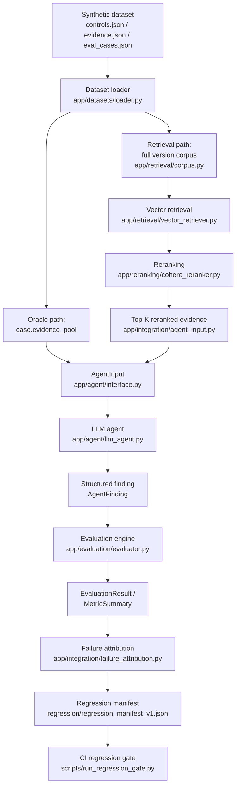

# Architecture

This document describes the components that actually exist in this
repository and how data flows between them. It does not describe
aspirational or planned components — see `README.md`'s "Future Work"
for those.

## Data flow

Two evidence paths feed the same `AgentInput`/`AgentRunner` boundary:

- **Oracle path** — `case.evidence_pool` (the benchmark's hand-curated
  evidence for that one case) via `build_agent_input`. Used for the
  original LLM baseline.
- **Retrieval path** — the full corpus (every evidence record across
  the dataset version, never a single case's own pool) via vector
  retrieval, then reranking, then `build_retrieved_agent_input`. Used
  for the reranked-evidence LLM experiment.

Both paths converge on the identical `AgentInput` schema and the
identical `LLMAgent`/evaluator/tracing code — the agent under test
cannot tell which path produced its evidence, and no evaluation code
is duplicated between them.

## Components

### Contracts (`app/models/contracts.py`)

The single source of truth for every shape that crosses a boundary:
`Control`, `Evidence`, `EvaluationCase`, `ExpectedOutcome` (ground
truth), `AgentFinding` (the agent's structured output), `ExecutionTrace`,
`EvaluationResult`, `MetricSummary`, `RunReport`. All Pydantic models
use `extra="forbid"`, so a malformed record or an attempt to smuggle an
unexpected field fails loudly at the boundary rather than propagating
silently.

### Dataset (`app/datasets/loader.py`)

Loads and cross-validates `datasets/{controls,evidence,eval_cases}.json`,
resolves a named **version** (`synthetic-v1`: the original 10 cases;
`synthetic-v2`: 30 cases, `synthetic-v1`'s cases unmodified) via
`datasets/versions.json`, and computes a SHA-256 **dataset fingerprint**
over exactly the controls/evidence/cases that version references — so
two runs can be confirmed to have used byte-identical benchmark content
even after the shared files grow to support later versions.

### Agent abstraction (`app/agent/interface.py`)

`AgentInput` is the *only* view of an `EvaluationCase` any agent
implementation is allowed to see. It structurally excludes every
ground-truth field (`ExpectedOutcome`, `required_evidence_ids`,
`rationale`, `failure_mode_tag`) — not by convention, but because those
fields have no place in the schema at all. `build_agent_input` (oracle
context) and `build_retrieved_agent_input` (retrieval/reranking
context) are two separate, non-overlapping constructors: the oracle
constructor's "must equal `case.evidence_pool`" invariant is never
relaxed to accommodate retrieval, and the retrieval constructor never
gains a backdoor into ground truth.

### Provider abstraction (`app/providers/base.py`, `app/providers/openai_provider.py`)

`LLMProvider` is a minimal protocol (`complete_structured(messages,
response_model) -> StructuredCompletion`) that both a real
`OpenAIProvider` and a test-only `FakeLLMProvider`
(`tests/support/fake_llm_provider.py`) implement identically. Every
provider-facing test in this repository uses the fake — no test in
`tests/` makes a network call.

### Execution traces (`app/observability/tracing.py`)

`run_traced` is the only place an `ExecutionTrace` is constructed. It
records latency, token usage, requested vs. served model, and — on a
model response that couldn't be parsed into a valid `AgentFinding`
(`AgentOutputError`) — a bounded, secret-free excerpt of what the model
actually returned, without aborting the run.

### Evaluation (`app/evaluation/evaluator.py`, `app/evaluation/metrics.py`)

`evaluate_finding` is the first point in the pipeline allowed to read
`EvaluationCase.expected_outcome`; its signature enforces the
dependency direction (it takes an already-produced `AgentFinding`, so
ground truth cannot leak backward into agent execution). Computes
per-case `citation_validity` (were the agent's citations to real,
presented documents) and `required_evidence_recall` (did the agent
cite what ground truth says was actually necessary) — two deliberately
distinct questions. `app/evaluation/metrics.py` aggregates these into a
`MetricSummary` (accuracy, macro F1, exception precision/recall,
abstention precision/recall/F1, schema validity).

### Retrieval (`app/retrieval/`)

`EvidenceCorpus` (`corpus.py`) is the **full version corpus** — every
evidence record a dataset version references, never a single case's
`evidence_pool` — specifically so a retriever must discriminate
relevant from irrelevant evidence rather than trivially "finding" a
handful of pre-curated documents. `VectorRetriever` embeds queries and
documents (`EmbeddingProvider` abstraction, real adapter:
`openai_embedding_provider.py`) and ranks by cosine similarity;
`CorpusEmbeddingIndex` embeds the corpus once and reuses it across
every query. `RetrievalResult`/`RetrievedEvidence` carry no ground
truth. Recall@K and MRR are computed in `metrics.py`.

### Reranking (`app/reranking/`)

Consumes a **preserved** `RetrievalResult` (never re-embeds) and
reorders/truncates its candidates. `CohereReranker` is the real
adapter; `PassThroughReranker` is a deterministic control condition
proving the reranking stage itself introduces zero metric delta.
`RerankResult.candidates` is validated to be a *subset* of the input
candidates — a reranker can trim, never invent, evidence.
`app/reranking/pacing.py`'s `CallPacer` enforces a minimum interval
between provider calls (built after a real trial-tier rate limit —
see `docs/incidents/2026-09-24-cohere-reranking-rate-limit.md`).

### Integration layer (`app/integration/`)

The Phase 8 wiring from a preserved reranking artifact to the existing
LLM agent: `source.py` loads and SHA-256/provenance-verifies that
artifact before any provider call; `agent_input.py` hydrates a case's
Top-K reranked candidate IDs into full `Evidence` and builds an
`AgentInput` via the same retrieval-context constructor retrieval
itself uses; `failure_attribution.py` classifies a wrong or weak
outcome into one of five layers (candidate-generation miss, ranking
issue, LLM decision/synthesis issue, citation/grounding issue,
malformed-output) using only already-produced artifact fields, never
hidden model reasoning; `runner.py` orchestrates the whole case loop
and produces a `RerankedLLMReport`.

### Regression gate (`app/regression/`)

Turns observed official-run failures into a persistent, offline,
CI-checkable floor. `manifest.py` defines the schema; `gate.py` compares
any future evaluation artifact's `EvaluationResult`s against those
floors — never re-running a model, never re-deriving ground truth. See
`docs/REGRESSION_GATE.md` for the full design rationale.

### Artifact / provenance system

Every real-provider experiment (`scripts/run_*.py`) follows the same
discipline, documented in full in `docs/ARTIFACT_POLICY.md`:

- An immutable, run-ID-qualified output path
  (`results/<category>/<dataset>__<config>__<run_id>.json`), computed
  and collision-checked *before* any provider call.
- A mandatory Git commit SHA captured once per run
  (`app/observability/git_provenance.py`) — a real experiment with no
  code provenance is refused, not silently recorded.
- A dataset fingerprint and, for retrieval, a corpus fingerprint.
- Requested vs. served model name, recorded separately — a served
  model name is never fabricated when a provider doesn't report one.
- Atomic writes (temp file + `os.replace`) so a crash mid-write can
  never leave a half-written artifact at the real destination.

### Real-API authorization boundary (`app/observability/real_api_gate.py`)

A fail-closed gate independent of credential presence: every
`_build_*` function that constructs a real provider client calls
`require_real_api_authorization(...)` as its last check before that
construction. It passes only when `ARL_ALLOW_REAL_API_CALLS` is set to
exactly `"1"` in the process environment — a credential loaded from
`.env` or exported directly never satisfies this by itself. This exists
because credential presence alone previously did enable an unintended
real call; see
`docs/incidents/2026-09-24-unauthorized-real-openai-calls-during-phase-8a-smoketest.md`.
